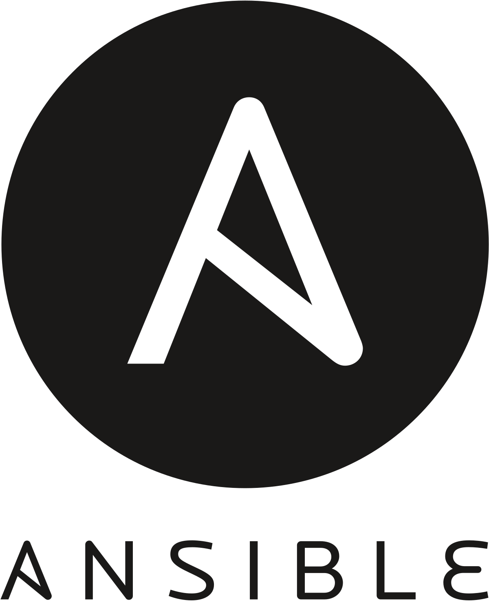

<h1 align="center">
Hello world, I'm Mario 👋🏾
</h1>
Sysadmin from Côte d'Ivoire (Africa), enthusiastic about solving problems with a constantly growing love for new technologies. 
I also enjoy watching animes & playing guitar 

  
<b>I'm continously learning</b> 👇

   

<a href="https://terraform.io/" target="_blank">
<a href="https://kubernetes.io/" target="_blank">
<a href="https://ansible.com/" target="_blank">
<a href="https://docker.com/" target="_blank">
<a href="https://jenkins.com/" target="_blank">

  
<b>Statistics</b> 📈

  

  
  
  
  
  
   
   
  
  
